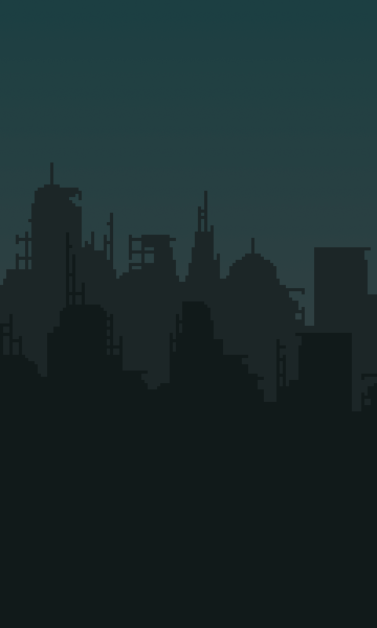

# 📌 README.md
**📍This file include all project instruction.**
> ## _RobotArm_Project_ 🤖

---

**⭐︎ How to control?**

: You can select robot arm joint (from bottom 1,2,3) using number key 1, 2, 3.
Press the space key to hold the gripper and press again to stop.
play: If you press the direction key while holding the number key, you can rotate robot arm.

---

**⭐︎ Main idea**

: using Rmat function, you can rotate polygons.

```python
def Rmat(degree):
    rad = np.deg2rad(degree)
    c = np.cos(rad)
    s = np.sin(rad)
    R = np.array([[c, -s, 0],
                  [s,  c, 0], [0, 0, 1]])
    return R
```

: using Tmat function, you can move polygons.

```python
def Tmat(tx, ty):
    Translation = np.array([
        [1, 0, tx],
        [0, 1, ty],
        [0, 0, 1]
    ])
    return Translation

```

---

youtube link
[](https://youtu.be/i2TLwd6HLls)

> ## _Shmup_Project_ 🚀

---

- Code sources: [KidsCanCode](https://kidscancode.org/blog/) - Game Development with Pygame video series <Shmup game - part 10>

- Image, Sound sources: [www.opengameart.org](www.opengameart.org)

---

I used these images...

##### Images at **img** directory

> - background image
>
>   </img>

> - etc image ..more
>   <!-- prettier-ignore -->
>   
>     
>   
>   
>   

**⭐︎ Adding graphics**

: The img directory containing the image file should be located on the same directory as the running file.

My img directory:

> img/alien.png

> img/meteorGrey_big1.png

> img/regularExplosion00.png

> img/Ruined_City_Background.png
> etc..

#### _Code_

```python
background = pygame.image.load(
    path.join(img_dir, "Ruined_City_Background.png")).convert()
background_rect = background.get_rect()
player_img = pygame.image.load(
    path.join(img_dir, "playerShip2_red.png")).convert()
bullet_img = pygame.image.load(path.join(img_dir, "laserBlue16.png")).convert()
meteor_images = []
meteor_list = ['meteorGrey_big1.png', 'meteorGrey_big2.png', 'meteorGrey_med1.png',
               'meteorGrey_med2.png', 'meteorGrey_small1.png', 'meteorGrey_small2.png',
               'meteorGrey_tiny1.png']
for img in meteor_list:
    meteor_images.append(pygame.image.load(path.join(img_dir, img)).convert())
explosion_anim = {}
explosion_anim['lg'] = []
explosion_anim['sm'] = []
for i in range(9):
    filename = 'regularExplosion0{}.png'.format(i)
    img = pygame.image.load(path.join(img_dir, filename)).convert()
    img.set_colorkey(BLACK)
    img_lg = pygame.transform.scale(img, (75, 75))
    explosion_anim['lg'].append(img_lg)
    img_sm = pygame.transform.scale(img, (32, 32))
    explosion_anim['sm'].append(img_sm)
```

---

I made these sound files... using [Bfxr](https://www.bfxr.net)

##### sound files at **snd** directory

**⭐︎ Adding sound and music**

: The snd directory containing the sound file should be located on the same directory as the running file.

My snd directory:

> /snd/Explosion.wav

> /snd/Explosion2.wav

> /snd/laser.wav

> /snd/space.org

#### _Code_

```python
shoot_sound = pygame.mixer.Sound(path.join(snd_dir, 'laser.wav'))
expl_sounds = []
for snd in ['Explosion.wav', 'Explosion2.wav']:
    expl_sounds.append(pygame.mixer.Sound(path.join(snd_dir, snd)))
pygame.mixer.music.load(
    path.join(snd_dir, 'space.ogg'))
pygame.mixer.music.set_volume(0.4)
```

---

**⭐︎ How to control?**

: This is going to be a keyboard controlled game, so we want the player to move when the Left or Right arrow keys are pressed. The player presses the spacebar, a bullet will be fired.

**⭐︎ Main idea**

1. **Enemy sprites**

   - It also adds x-direction movement.

   ```python
    self.speedy = random.randrange(1, 8)
    self.speedx = random.randrange(-3, 3)
   ```

   - A mob moving diagonally will go off the side long before it goes off the bottom, so this way we are sure to reset it relatively quickly.

   ```python
   def update(self):
       self.rotate()
       self.rect.x += self.speedx
       self.rect.y += self.speedy
       if self.rect.top > HEIGHT + 10 or self.rect.left < -100 or self.rect.right > WIDTH + 100:
           self.rect.x = random.randrange(WIDTH - self.rect.width)
           self.rect.y = random.randrange(-100, -40)
           self.speedy = random.randrange(1, 8)
   ```

   - We are going to want to have many enemies, so we’re going to make a new group called mobs to hold them all. Then we spawn a number of mobs and add them to the groups.

   ```python
    all_sprites = pygame.sprite.Group()
    mobs = pygame.sprite.Group()
    bullets = pygame.sprite.Group()
    player = Player()
    all_sprites.add(player)
    for i in range(8):
        newmob()
   ```

2. **Colliding**

   - a mob hit the player

   ```python
   # check to see if a mob hit the player
   hits = pygame.sprite.spritecollide(
       player, mobs, True, pygame.sprite.collide_circle)
       # using circular bounding box
   for hit in hits:
       player.shield -= hit.radius * 2
       expl = Explosion(hit.rect.center, 'sm')
       all_sprites.add(expl)
       newmob()
       if player.shield <= 0:
           running = False # game over
   ```

   - a bullet hit a mob

   ```python
   # check to see if a bullet hit a mob
   hits = pygame.sprite.groupcollide(mobs, bullets, True, True)
    for hit in hits:
        score += 50 - hit.radius
        random.choice(expl_sounds).play()
        expl = Explosion(hit.rect.center, 'lg')
        all_sprites.add(expl)
        newmob()
   ```

3. **Score**

   we just need a score variable, which we’ll initialize to 0 and add to every time a bullet destroys a meteor. Since we have different sized meteors, so makes sense to give more points for hitting a smaller one.(using hit.radius)

   ```python
   hits = pygame.sprite.groupcollide(mobs, bullets, True, True)
       for hit in hits:
           score += 50 - hit.radius
           random.choice(expl_sounds).play()
           expl = Explosion(hit.rect.center, 'lg')
           all_sprites.add(expl)
           newmob()
   ```
