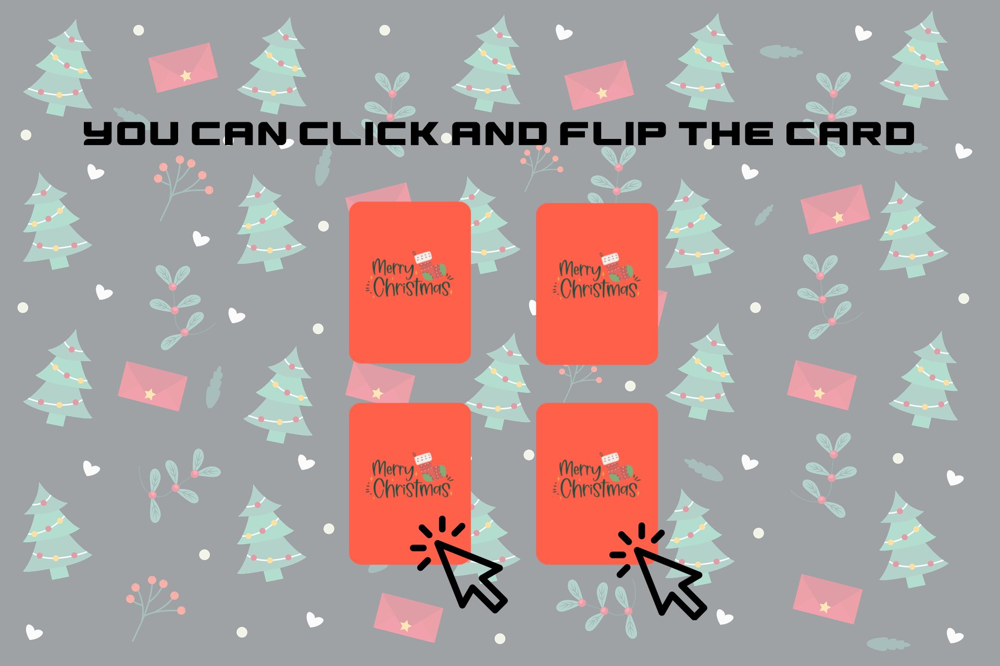
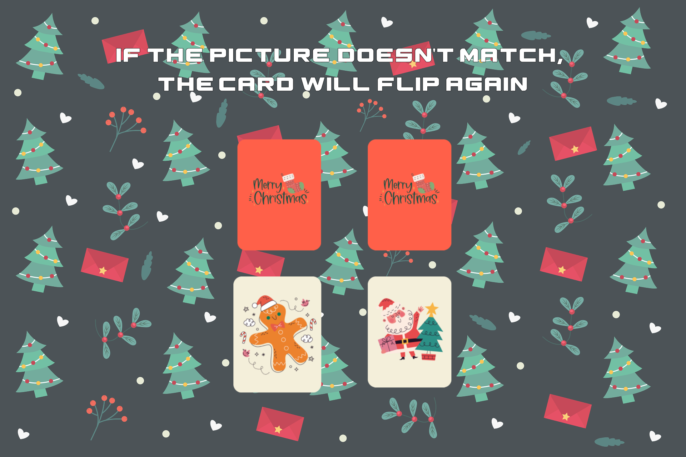
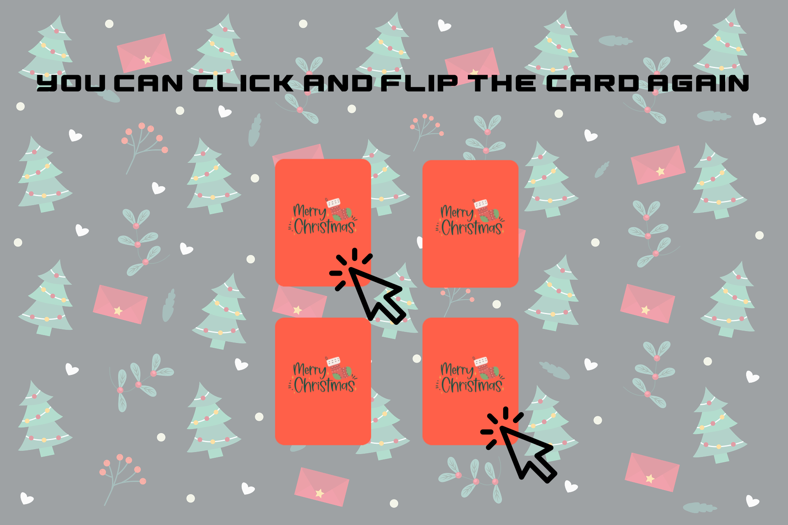
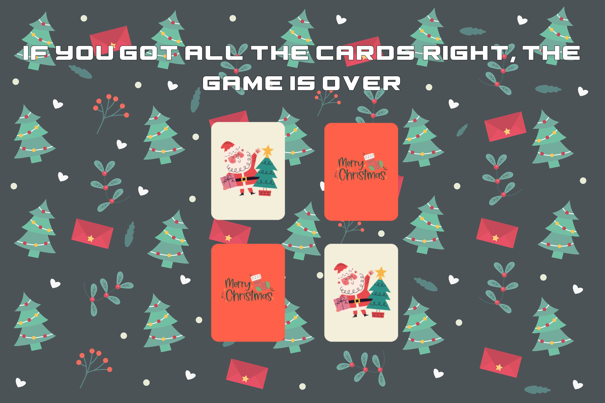
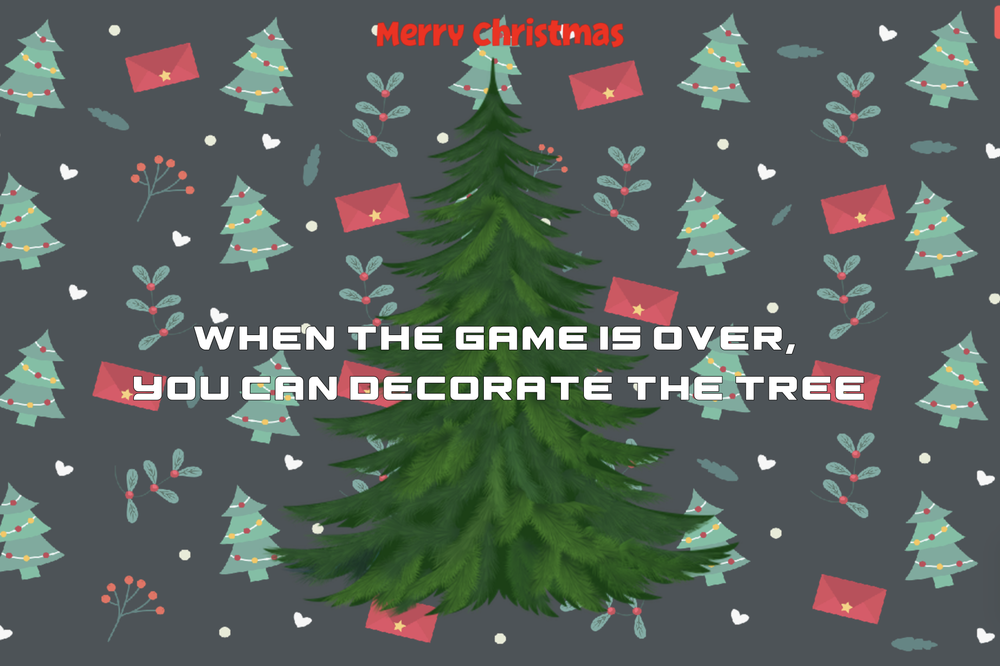
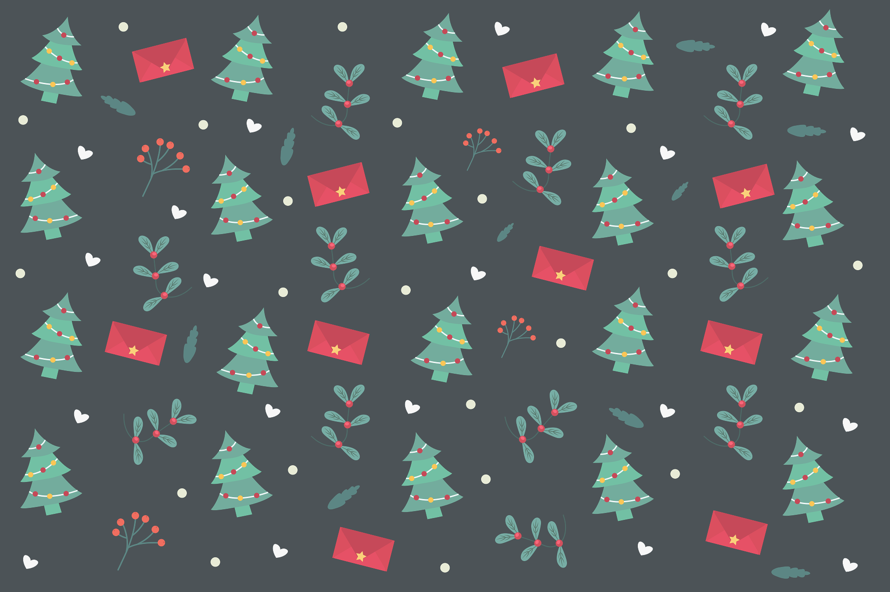
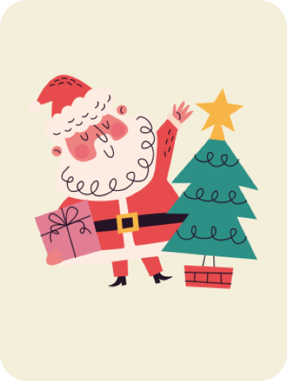
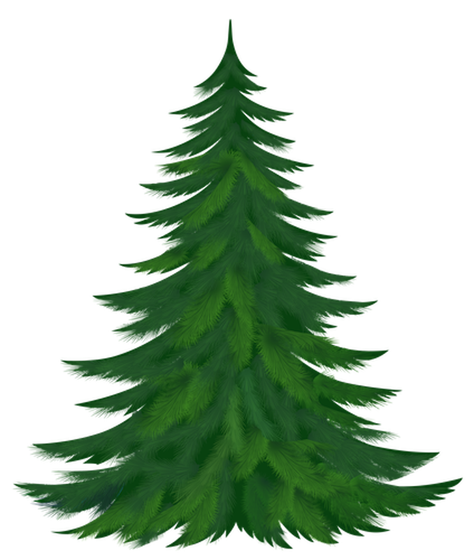
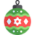
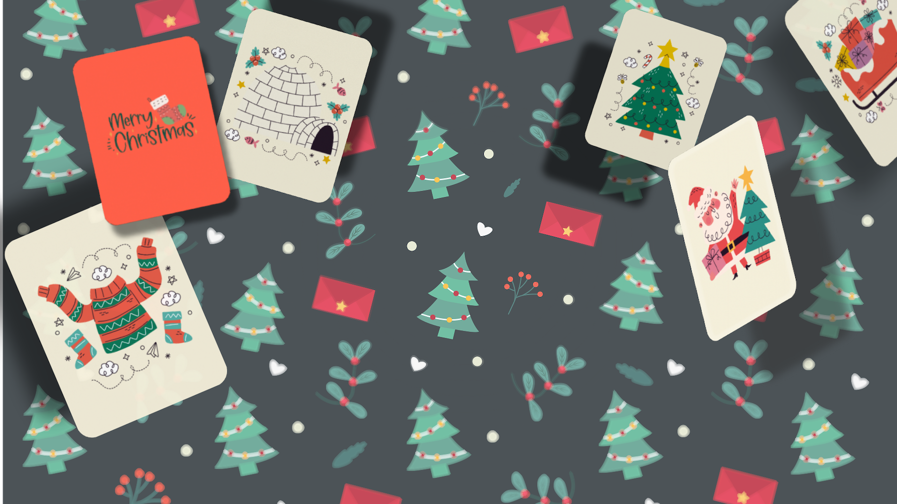

# 📌 README.md

**📍This file include all project instruction.**

> ## _RobotArm_Project_ 🤖

---

**⭐︎ How to control?**

: You can select robot arm joint (from bottom 1,2,3) using number key 1, 2, 3.
Press the space key to hold the gripper and press again to stop.
play: If you press the direction key while holding the number key, you can rotate robot arm.

---

**⭐︎ Main idea**

: using Rmat function, you can rotate polygons.

```python
def Rmat(degree):
    rad = np.deg2rad(degree)
    c = np.cos(rad)
    s = np.sin(rad)
    R = np.array([[c, -s, 0],
                  [s,  c, 0], [0, 0, 1]])
    return R
```

: using Tmat function, you can move polygons.

```python
def Tmat(tx, ty):
    Translation = np.array([
        [1, 0, tx],
        [0, 1, ty],
        [0, 0, 1]
    ])
    return Translation

```

---

YouTube link 🎥 (click this image)

[](https://youtu.be/i2TLwd6HLls)

---

> ## _Shmup_Project_ 🚀

---

- Code sources: [KidsCanCode](https://kidscancode.org/blog/) - Game Development with Pygame video series <Shmup game - part 10>

- Image, Sound sources: [www.opengameart.org](www.opengameart.org)

---

I used these images...

##### Images at **img** directory

> - background image
>
>   </img>

> - etc image ..more
>
>   <!-- prettier-ignore -->
>     
>   
>   
>   

**⭐︎ Adding graphics**

: The img directory containing the image file should be located on the same directory as the running file.

My img directory:

> img/alien.png

> img/meteorGrey_big1.png

> img/regularExplosion00.png

> img/Ruined_City_Background.png
> etc..

#### _Code_

```python
background = pygame.image.load(
    path.join(img_dir, "Ruined_City_Background.png")).convert()
background_rect = background.get_rect()
player_img = pygame.image.load(
    path.join(img_dir, "playerShip2_red.png")).convert()
bullet_img = pygame.image.load(path.join(img_dir, "laserBlue16.png")).convert()
meteor_images = []
meteor_list = ['meteorGrey_big1.png', 'meteorGrey_big2.png', 'meteorGrey_med1.png',
               'meteorGrey_med2.png', 'meteorGrey_small1.png', 'meteorGrey_small2.png',
               'meteorGrey_tiny1.png']
for img in meteor_list:
    meteor_images.append(pygame.image.load(path.join(img_dir, img)).convert())
explosion_anim = {}
explosion_anim['lg'] = []
explosion_anim['sm'] = []
for i in range(9):
    filename = 'regularExplosion0{}.png'.format(i)
    img = pygame.image.load(path.join(img_dir, filename)).convert()
    img.set_colorkey(BLACK)
    img_lg = pygame.transform.scale(img, (75, 75))
    explosion_anim['lg'].append(img_lg)
    img_sm = pygame.transform.scale(img, (32, 32))
    explosion_anim['sm'].append(img_sm)
```

---

I made these sound files... using [Bfxr](https://www.bfxr.net)

##### sound files at **snd** directory

**⭐︎ Adding sound and music**

: The snd directory containing the sound file should be located on the same directory as the running file.

My snd directory:

> /snd/Explosion.wav

> /snd/Explosion2.wav

> /snd/laser.wav

> /snd/space.org

#### _Code_

```python
shoot_sound = pygame.mixer.Sound(path.join(snd_dir, 'laser.wav'))
expl_sounds = []
for snd in ['Explosion.wav', 'Explosion2.wav']:
    expl_sounds.append(pygame.mixer.Sound(path.join(snd_dir, snd)))
pygame.mixer.music.load(
    path.join(snd_dir, 'space.ogg'))
pygame.mixer.music.set_volume(0.4)
```

---

**⭐︎ How to control?**

: This is going to be a keyboard controlled game, so we want the player to move when the Left or Right arrow keys are pressed. The player presses the spacebar, a bullet will be fired.

**⭐︎ Main idea**

1. **Enemy sprites**

   - It also adds x-direction movement.

   ```python
    self.speedy = random.randrange(1, 8)
    self.speedx = random.randrange(-3, 3)
   ```

   - A mob moving diagonally will go off the side long before it goes off the bottom, so this way we are sure to reset it relatively quickly.

   ```python
   def update(self):
       self.rotate()
       self.rect.x += self.speedx
       self.rect.y += self.speedy
       if self.rect.top > HEIGHT + 10 or self.rect.left < -100 or self.rect.right > WIDTH + 100:
           self.rect.x = random.randrange(WIDTH - self.rect.width)
           self.rect.y = random.randrange(-100, -40)
           self.speedy = random.randrange(1, 8)
   ```

   - We are going to want to have many enemies, so we’re going to make a new group called mobs to hold them all. Then we spawn a number of mobs and add them to the groups.

   ```python
    all_sprites = pygame.sprite.Group()
    mobs = pygame.sprite.Group()
    bullets = pygame.sprite.Group()
    player = Player()
    all_sprites.add(player)
    for i in range(8):
        newmob()
   ```

2. **Colliding**

   - a mob hit the player

   ```python
   # check to see if a mob hit the player
   hits = pygame.sprite.spritecollide(
       player, mobs, True, pygame.sprite.collide_circle)
       # using circular bounding box
   for hit in hits:
       player.shield -= hit.radius * 2
       expl = Explosion(hit.rect.center, 'sm')
       all_sprites.add(expl)
       newmob()
       if player.shield <= 0:
           running = False # game over
   ```

   - a bullet hit a mob

   ```python
   # check to see if a bullet hit a mob
   hits = pygame.sprite.groupcollide(mobs, bullets, True, True)
    for hit in hits:
        score += 50 - hit.radius
        random.choice(expl_sounds).play()
        expl = Explosion(hit.rect.center, 'lg')
        all_sprites.add(expl)
        newmob()
   ```

3. **Score**

   we just need a score variable, which we’ll initialize to 0 and add to every time a bullet destroys a meteor. Since we have different sized meteors, so makes sense to give more points for hitting a smaller one.(using hit.radius)

   ```python
   hits = pygame.sprite.groupcollide(mobs, bullets, True, True)
       for hit in hits:
           score += 50 - hit.radius
           random.choice(expl_sounds).play()
           expl = Explosion(hit.rect.center, 'lg')
           all_sprites.add(expl)
           newmob()
   ```

---

YouTube link 🎥 (click this image)

[](https://youtu.be/V_S9P3KKImQ)

---

> ## _MISS-MATCH_ card game_project 🃏

##### my final project 😀

---

**⭐︎ My plan**

: See pdf file. my pdf file is in Final_Project directory.

[MYPLAN](https://github.com/noeyish/MAS2011_VMP/blob/main/Final_Project/20221573_심하연_vmp_pj.pdf)

---

**⭐︎ Tutorial**

1.</img> 2.</img>

3.</img> 4.</img>

5.</img> 6.</img>

---

**⭐︎ How to Play**

: The game initiates from the main menu screen, featuring four buttons in sequential order: tutorial, save, game start, and exit. All game interactions are executed through mouse clicks. Clicking on the tutorial button provides a comprehensive guide on how to play the game.

Upon selecting the game start button, you encounter three additional buttons labeled 1, 2, and 3, representing different difficulty levels. Level 1 consists of 10 cards, Level 2 comprises 16 cards, and Level 3 challenges players with 24 cards, each varying in difficulty.

As the game commences, a brief period of time reveals the card fronts before initiating the card pairing process. Each flip contributes to the flip count, serving as an indicator to calculate the user's score at the game's conclusion. Successfully matching two identical cards triggers the appearance of the "match!" text. Conversely, an incorrect match results in the display of the "miss!" text, and the cards are flipped back.

Completing the card matching successfully allows users to earn stars based on the flip count. The number of accumulated stars serve as ornaments for decorating a tree. Once a tree is created by dragging ornaments, users can utilize the "s" key to save christmas tree. The saved screen can be revisited by clicking the save button on the main menu.

---

**⭐︎ Score**

: If you flip the card by the number of cards, you get three stars.
In this way, the number of cards +1 to 3 receives two stars, the number of cards +4 to 6 receives one star, and the number of cards +7~ to receive a fail.

After you play game, receive as many as the number of stars you get.

---

**⭐︎ Adding Graphics**

: I used this site to create my Card packs, Back ground, Buttons..etc

All images are in the img directory

[flaticon](https://www.flaticon.com) , [pixabay](https://pixabay.com)

> - image ..more
>
>    <!-- prettier-ignore -->
>
>   </img> </img> </img> </img> </img> </img> </img> </img>

I made my start screen using [Pixlr](https://www.pixlr.com)

>   

---

**⭐︎ Adding sound and music**

: The snd directory containing the sound file should be located on the same directory as the running file.

[pixabay](https://pixabay.com) , [opengameart.org](https://opengameart.org)

My snd directory:

> /snd/click.wav

> /snd/error.ogg

> /snd/flip.wav

> /snd/joyful-snowman.mp3 # playing cound

... etc

---
**⭐︎ Adding Font**

> font/Silver.ttf

I download this file at
[dafont](https://www.dafont.com/silver-broom.font)

---

**⭐︎ Animation effect**

: **card flip animation**

It reduces the width of the card while giving it the effect of flipping.

```python
def flip_animation(card_index, screen, board):

    ...

    # 카드를 좌우로 뒤집는 애니메이션
    for scale in list(range(CARD_WIDTH, 0, -9)) + list(range(0, CARD_WIDTH, 9)):

        # 해당 카드를 제외하고 모든 카드를 그림
        draw_all_cards_except(screen, board, [card_index])
        card = board[card_index][0]
        scaled_card = pygame.transform.scale(
            card_images[card], (scale, CARD_HEIGHT))
        draw_exit_button(screen)
        display_flip_count(screen)
        screen.blit(scaled_card, card_pos)
        pygame.display.flip()

    ...

```

: **card match animation**

If the card pair is correct, the card disappears as it gets smaller.

```python
def match_animation(card_indices, screen, board):
    # 각 카드의 원본 이미지와 위치 가져오기

    ...

    # 크기를 점차 줄여가며 애니메이션 표시
    for scale_factor in range(100, 0, -8):  # 100%에서 0%까지 5%씩 감소
        draw_all_cards_except(screen, board, card_indices)  # 리스트로 전달

        for i, index in enumerate(card_indices):
            scaled_size = (int(original_sizes[i][0] * scale_factor / 100),
                           int(original_sizes[i][1] * scale_factor / 100))
            if scaled_size[0] > 0 and scaled_size[1] > 0:
                scaled_card = pygame.transform.scale(
                    original_images[i], scaled_size)
                pos_x = card_positions[i][0] + \
                    (original_sizes[i][0] - scaled_size[0]) // 2
                pos_y = card_positions[i][1] + \
                    (original_sizes[i][1] - scaled_size[1]) // 2
                draw_exit_button(screen)
                display_flip_count(screen)
                screen.blit(scaled_card, (pos_x, pos_y))

        pygame.display.flip()

    ...
```

: **fadeout animation**

When switching the screen, it gradually fills the screen with black and gives a fade-out effect.

```python
def fade_out_animation(screen):
    fade_surface = pygame.Surface((WIDTH, HEIGHT))
    fade_surface.fill((0, 0, 0))
    for alpha in range(0, 255, 5): # Increase alpha to fade out
        fade_surface.set_alpha(alpha)
        screen.blit(fade_surface, (0, 0))
        pygame.display.flip()
        pygame.time.delay(20)
```

---

**⭐︎ matching algorithm**

It's the main logic of the game, so I'll briefly explain this part.

```python
def game_loop():
    global flipped_cards, flip_count, board, matched_pairs
    flip_count = 0
    running = True

    global total_flips
    # set_background(current_level)
    while running:
        # set_background(current_level)
        draw_all_cards(screen)
        display_flip_count(screen)
        draw_exit_button(screen)
        for event in pygame.event.get():
            if event.type == pygame.QUIT:
                pygame.quit()
                sys.exit()
            elif event.type == pygame.MOUSEBUTTONDOWN:

                x, y = pygame.mouse.get_pos()

                if exit_button_rect.collidepoint(x, y):
                    click_sound.play()
                    running = False

                if selected_level == "Level 1":
                    cols, rows = 5, 2
                elif selected_level == "Level 2":
                    cols, rows = 4, 4
                elif selected_level == "Level 3":
                    cols, rows = 6, 4

                relative_x = x - start_x
                relative_y = y - start_y
                if len(flipped_cards) == 2:
                    card1_index, card2_index = flipped_cards
                    card1 = board[card1_index][0]
                    card2 = board[card2_index][0]
                    total_flips += 1
                if 0 <= relative_x < cols * (CARD_WIDTH + CARD_GAP) and 0 <= relative_y < rows * (CARD_HEIGHT + CARD_GAP):
                    card_index = (relative_y // (CARD_HEIGHT + CARD_GAP)) * \
                        cols + (relative_x // (CARD_WIDTH + CARD_GAP))

                    # Check if the clicked card is already matched
                    if board[card_index][0] in matched_pairs:
                        continue  # Skip if the card is already matched

                    # Check if the card is already flipped or matched
                    if card_index in matched_pairs or card_index in flipped_cards:
                        continue
                    flip_sound.play()
                    display_flip_count(screen)

                    flip_animation(card_index, screen, board)
                    flipped_cards.append(card_index)

                    board[card_index] = (cards[card_index], True)

                    flip_count += 1

                    if flip_count == 2:
                        card1_index, card2_index = flipped_cards
                        card1 = board[card1_index][0]
                        card2 = board[card2_index][0]
                        total_flips += 1

                        if card1 == card2:
                            match_sound.play()
                            matched_pairs.add(card1)
                            show_message("Match!", screen)
                            pygame.time.delay(400)
                            match_animation(
                                [card1_index, card2_index], screen, board)
                            flipped_cards = []  # 매치된 카드는 다시 클릭할 수 없도록 flipped_cards 비우기
                        else:
                            error_sound.play()
                            show_message("Miss!", screen)
                            pygame.time.delay(500)
                            flip_sound.play()
                            flip_animation(card1_index, screen, board)
                            flip_sound.play()
                            flip_animation(card2_index, screen, board)

                            board[card1_index] = (card1, False)
                            board[card2_index] = (card2, False)

                        flip_count = 0
                        flipped_cards = []

                    if len(matched_pairs) == len(cards) // 2:
                        end_message("Game Over!", screen)
                        fade_out_animation(screen)
                        game_over()

        draw_exit_button(screen)
        display_flip_count(screen)
        pygame.display.flip()
        clock.tick(FPS)
```

> Global Variables:

```python
    flipped_cards
    #Index of the current flipped card

    flip_count
    #The number of cards that have been flipped on the current turn

    board
    #represents the game board and saves the status of each card

    matched_pairs
    #set containing the index of the matched card
```

> Mouse click processing:

Make sure the mouse click is above the end button, and if it is above it, click Run as False.
Determines the number of rows and columns of the game board based on the game level selected.

> Flipping the card:

Calculate the index of the card you click based on the mouse position,
Determine if the clicked card already matches, flips, or is part of the current flipping card
Otherwise, play the flip sound and update the display to display the flip card
Track flip count and flip index

> Matching the card:

Verify that the two cards are flipped and matched, and if they match, play a match, update the display, and mark the card as a match
If it does not match, a "Miss!" message will be displayed when you play an error sound and flip the card back after a delay.

> Check if the game is complete:

Make sure all card pairs match. If so, trigger the fade-out animation before displaying the "Game Over!" message and calling the Game_over() function.

> Draw and update the display:

Call the function that draws the end button and the function that represents the number of skips.
Use fps (clock.tick) to manage frame rates

---

**⭐︎ Save my decoratrion ✨ file**

JavaScript Object Notation (JSON) is a lightweight data format for effectively exchanging and storing data. It has features that are easy for humans to read and write, and easy for machines to parse and create. JSON was originally derived from JavaScript, but is now supported by several programming languages. I use this data file to save the data.

---

**⭐︎ Game trailor🎥**
(click this image)

[](https://youtu.be/FqXi3i2b51Q)

---
